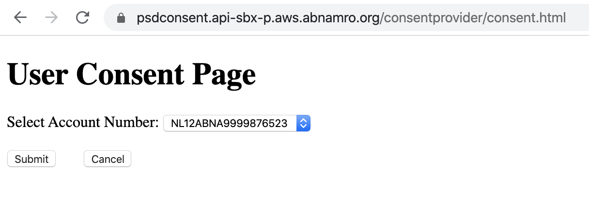
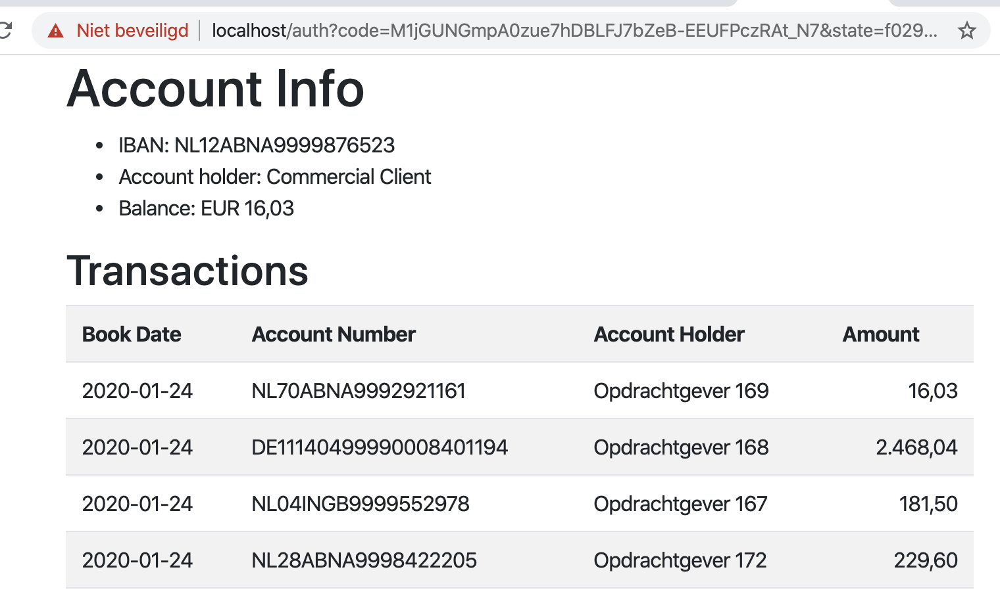

# Consuming the Abn Amro Bank API

In here I provide a simple example for consuming the Abn Amro Accounts API, see https://developer.abnamro.com
The developer portal oof Abn Amro opened in November 2017. Since June 2019 the Accounts and Payments APIs are available, following the PSD2 regulations.

If you want to run the sample code in here, you will need to register an application in the developer portal. The Sandbox is available for everyone. For production you'll need to be FCA accredited and so on.

Once you run the application, you can go to the consent page in a browser.
From there the following steps are performed:
1. the application calls the 'obtain consent' service; this will end with a redirection to the  Abn Amro consent page  
1. in which the user can select an account for which it gives the application access
1. the application will now retrieve a token (OAuth2 grant type is authorization_code)
1. with the token it gets the consent info (we retrieve the iban for the user gave consent)
1. with the token and the iban we now retrieve account information and transaction data

Some observations (compared with other bank APIs):
* in the Abn Amro API there does not seem to be any signing of the messages
* a bit tricky: the URL for obtaining consent is using normal port 443, but the URL for obtaining an OAuth access token uses port 8443
* the redirect URL can only be https://localhost/auth (not even http instead of https is allowed)
* the data model for a transaction includes an attribute called `descriptionLines` which seems to contain quite some unstructured information in the form of an array of strings

---

## Technical solution

For this I have used the following technologies:
* Maven (https://maven.apache.org/)
* Kotlin (https://kotlinlang.org/)
* Ktor framework, client and server (https://ktor.io/)
* Kodein Dependency Injection (https://kodein.org/Kodein-DI/)
* MicroUtils logging (https://github.com/MicroUtils/kotlin-logging)
* Freemarker template engine (https://freemarker.apache.org/)
* Bootstrap for a bit of html styling (https://getbootstrap.com/)

Run the application for example as follows:

    mvn exec:java -Dexec.mainClass="nl.brachio.abnamro.ApplicationKt")

 or directly from the IDE or any other way.
 
 Point your browser to http://localhost
 After you click the link you will be taken to the Abn Amro consent page:
 
 
 
 After selecting an account you should see something like this:
 
 
 
 
 Note that https is required. In the example here I have used a self-signed certificate for the https server, and therefore the browser gives a warning.
 
 Below is an example with the description per transaction:
 